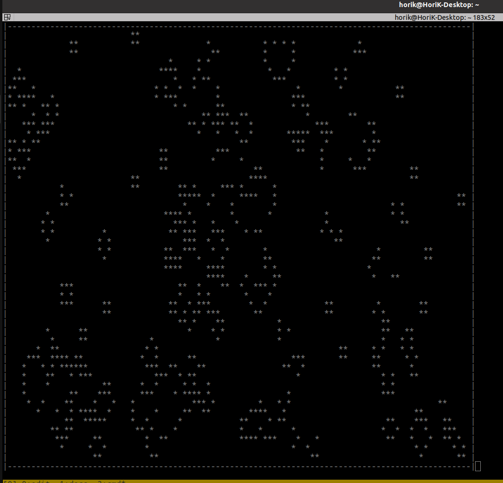

<h2> terminal_lifegame</h2>

ターミナル上で動作するライフゲーム(Coway's Game of Life)です。
開始すると生存セルがランダムに生成され、以降は画面を書き直すごとに
1世代ずつ世代交代が進行します。

画面の制御のためにncursesを利用しています。

<h2>コンパイル時</h2>

$ gcc -o lifegame lifegame.c -lncurses

<h2>実行時</h2>

$ ./lifegame

<h2>実行イメージ</h2>

